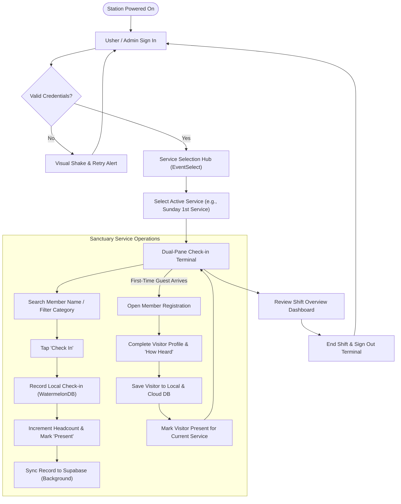
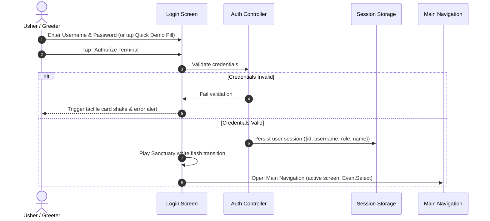
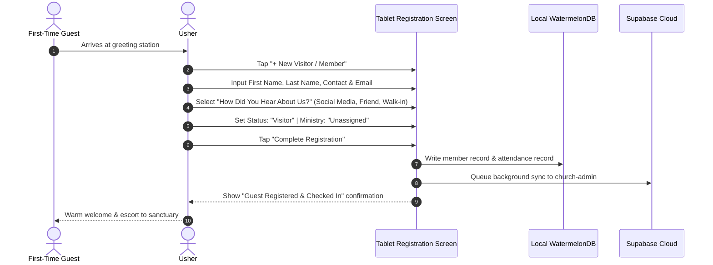
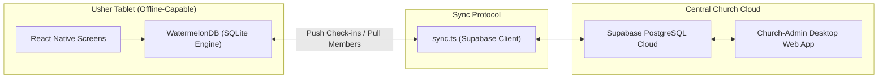

# Church Usher Tablet App — Operational & Technical Workflow

This document outlines the operational and technical workflow for the **Church Usher Tablet Application** (`Church-App`). The tablet application is designed for church greeters and ushers stationed at sanctuary entrances and lobbies to **monitor live service attendance**, **register first-time visitors**, and **manage usher shift duties** with a high-performance, local-first tablet interface.

---

## Table of Contents
1. [System Architecture & Station Overview](#1-system-architecture--station-overview)
2. [Role-Based Access Control (RBAC)](#2-role-based-access-control-rbac)
3. [Master Operational Flowchart](#3-master-operational-flowchart)
4. [Phase 1: Terminal Authentication & Login](#phase-1-terminal-authentication--login)
5. [Phase 2: Service Gathering Selection](#phase-2-service-gathering-selection)
6. [Phase 3: Live Attendance Monitoring & Check-In](#phase-3-live-attendance-monitoring--check-in)
7. [Phase 4: New Visitor & Member Registration](#phase-4-new-visitor--member-registration)
8. [Phase 5: Shift Overview & Usher Protocols](#phase-5-shift-overview--usher-protocols)
9. [Local-First Offline Resilience & Cloud Sync](#local-first-offline-resilience--cloud-sync)
10. [Troubleshooting & FAQs](#troubleshooting--faqs)

---

## 1. System Architecture & Station Overview

The tablet app is optimized for **landscape tablet operation** (10"–12" Android tablets) placed at sanctuary reception stations, greeting booths, and entryway podiums.

```text
┌────────────────────────────────────────────────────────────────────────┐
│                        USHER TABLET STATION                            │
│                                                                        │
│  [ Mini Sidebar ]   [ Main Dual-Pane Terminal Viewport ]               │
│  - Sanctuary Crest  ├────────────────────────┬───────────────────────┤ │
│  - Check-in Nav     │ Member Directory       │ Session Attendees     │ │
│  - Register Nav     │ Search, Filter Tabs    │ Live Headcount & %    │ │
│  - Shift Overview   │ Quick Check-in Buttons │ Undo Actions          │ │
│  - Usher Profile    │                        │                       │ │
└────────────────────────────────────────────────────────────────────────┘
```

- **Runtime**: React Native 0.86 running natively on Android tablets.
- **Local Storage Engine**: WatermelonDB (SQLite) for instant, sub-millisecond local queries.
- **Remote Backend**: Supabase PostgreSQL for cloud sync with the Admin Web App.
- **Visual Design**: Warm sanctuary liturgical theme (Parchment `#f5f0e8`, Charcoal `#181614`, Gold `#b5973a`).

---

## 2. Role-Based Access Control (RBAC)

The application enforces strict **Role-Based Access Control (RBAC)** to ensure usher terminals operate smoothly during fast-paced Sunday services while keeping administrative controls restricted.

| Feature / Capability | Usher Account | Admin Account | Description / Permission Level |
|---|:---:|:---:|---|
| **Terminal Sign-In** | ✅ | ✅ | Access the tablet station using secure credentials. |
| **Select Active Service Gathering** | ✅ | ✅ | Choose Sunday services, midweek gatherings, or youth events. |
| **Live Attendance Monitoring** | ✅ | ✅ | Real-time viewing of checked-in members, attendance counts, and rates. |
| **Check In Attendees** | ✅ | ✅ | One-tap check-in marking members present with exact timestamps. |
| **Undo Check-In** | ✅ | ✅ | Revert accidental check-ins with one tap. |
| **Register New Visitors / Members** | ✅ | ✅ | Rapid intake of first-time guests, contact information, and channels. |
| **View Shift Overview Dashboard** | ✅ | ✅ | Monitor expected vs. actual headcounts and usher duty protocols. |
| **Role Pill & Badge Indication** | Emerald (`USHER`) | Gold/Crimson (`ADMIN`) | Visual role recognition in the sanctuary sidebar and account card. |
| **Admin System Management** | ❌ *(Admin Web Only)* | ✅ *(Via Admin Portal)* | Church-wide reporting, user creation, role editing, and database backups. |

### Account Credentials
- **Usher Accounts**: Standard station accounts designated for ushers (e.g. `usher1`, `usher2`). Limited to front-of-house intake and attendance monitoring.
- **Admin Accounts**: Supervisory accounts (e.g. `admin`). Possess administrative oversight on the tablet and full access to the desktop Church-Admin portal.

---

## 3. Master Operational Flowchart



---

## Phase 1: Terminal Authentication & Login

### Screen: [`LoginScreen`](file:///C:/Users/admin/Desktop/MyApp/src/screens/Login/index.tsx)
Every usher begins their shift by signing into the tablet terminal.



### Operational Guidelines:
1. Enter your assigned usher username (e.g. `usher1`) and password.
2. For training, rapid onboarding, or offline testing, one-tap **Quick Demo Access Pills** are available at the bottom of the card.
3. Upon authentication, the terminal transitions immediately into the **Service Gathering Hub**.

---

## Phase 2: Service Gathering Selection

### Screen: [`EventSelectScreen`](file:///C:/Users/admin/Desktop/MyApp/src/screens/EventSelect/index.tsx)
Usher terminals are event-driven. Before monitoring attendance, the usher selects which gathering is currently underway.

### Available Gathering Types:
- **Sunday Morning Worship** (e.g., 1st Service: 8:00 AM – 10:00 AM)
- **Sunday Afternoon Worship** (e.g., 2nd Service: 10:30 AM – 12:30 PM)
- **Midweek Prayer & Discipleship** (Wednesday 7:00 PM)
- **Youth & Young Adults Night** (Saturday 5:00 PM)

### Operational Guidelines:
1. Confirm the active service card displaying the **"Active Today"** emerald badge.
2. Tap **"Open Check-in Terminal"** to enter the live attendance dashboard for that specific service.

---

## Phase 3: Live Attendance Monitoring & Check-In

### Screen: [`CheckInScreen`](file:///C:/Users/admin/Desktop/MyApp/src/screens/CheckIn/index.tsx)
The terminal adopts a **dual-pane landscape workstation**:

```text
┌───────────────────────────────────────┬───────────────────────────────────────┐
│ LEFT PANE: Directory & Search         │ RIGHT PANE: Session Attendees Panel   │
├───────────────────────────────────────┼───────────────────────────────────────┤
│ [ 🔍 Search by name...          ][✕] │ 👥 ACTIVE SERVICE ATTENDANCE          │
│                                       │ Sunday Morning Worship (8:00 AM)      │
│ [ All (24) ] [ Youth ] [ Ministry ]   │                                       │
│                                       │ 38 Present  •  68% Expected           │
│ ───────────────────────────────────── │ ───────────────────────────────────── │
│ (JA) John Apolinario Juaquin          │ 1. John Apolinario Juaquin  (08:14 AM)│
│      Ministry • Adult                 │    [ Undo Check-in ]                  │
│      [ Check In ]                     │                                       │
│                                       │ 2. Maria Santos             (08:16 AM)│
│ (BB) Blaster Silog                    │    [ Undo Check-in ]                  │
│      Visitor • Youth                  │                                       │
│      [ ✓ Present ]                    │                                       │
└───────────────────────────────────────┴───────────────────────────────────────┘
```

### Key Capabilities:
1. **Instant Search**: Type any portion of a member's first or last name. Tap `✕` to clear immediately.
2. **Category Filter Tabs**: One-tap pills filter by:
   - **All**: Church-wide directory.
   - **Youth**: Youth and student ministry.
   - **Ministry**: Active volunteer team members (Choir, Ushers, Media, Pastors).
   - **Adults**: Regular adult attendees.
3. **One-Tap Check-In**:
   - Tap **"Check In"** on the member row.
   - The button instantly transforms into **"✓ Present"** in emerald green.
   - The right-hand panel adds the attendee to the top of the chronological log with a live timestamp.
4. **Undo Check-In**:
   - If an usher mistakenly checks in the wrong individual, tapping the check-in button again or tapping **"Undo"** in the session attendees panel safely removes the check-in record.

---

## Phase 4: New Visitor & Member Registration

### Screen: [`NewMemberScreen`](file:///C:/Users/admin/Desktop/MyApp/src/screens/NewMember/index.tsx)
When a guest visits the church for the first time, ushers transition to the registration portal directly from the check-in terminal via the **"+ New Visitor"** gold header button.



### Form Fields Captured:
1. **Personal Information**: First Name, Last Name, Gender (Male/Female toggle), Birthdate.
2. **Contact & Residence**: Mobile Phone Number, Email Address, Home / Residential Address.
3. **Church Involvement**:
   - **Status**: Visitor *(default for new guests)*, New Member, Member, Leader.
   - **Ministry Interest**: Unassigned, Youth Ministry, Worship Team, Ushers, Media Team, Children Ministry.
   - **Origin Attribution ("How did you hear about us?")**: Social Media, Invited by Friend, Flyer / Banner, Walk-In, Other.

---

## Phase 5: Shift Overview & Usher Protocols

### Screen: [`DashboardScreen`](file:///C:/Users/admin/Desktop/MyApp/src/screens/Dashboard/index.tsx)
During lulls or at the conclusion of intake, ushers use the **Shift Overview** screen to monitor key metrics:

- **Expected Attendees**: Target headcount based on previous weekly averages.
- **Active Attendees Checked In**: Real-time tally updated with every check-in.
- **New Visitors Welcomed**: Tally of first-time guests registered during this specific shift.
- **Usher Ministry Checklist**:
  - [x] Sanctuary station sanitized and tablet charged.
  - [x] Guest welcoming cards and bulletin packets on hand.
  - [x] Synchronize offline terminal records before concluding shift.
  - [x] Sign out of terminal at shift handover.

---

## Local-First Offline Resilience & Cloud Sync

Church sanctuaries and entryway lobbies frequently suffer from weak Wi-Fi or intermittent cellular coverage. The Usher Tablet App utilizes a **Local-First Architecture**:



### Sync Rules:
1. **No Wi-Fi? No Problem**: All check-ins and registrations are written instantly to the on-tablet SQLite database. The usher experiences **zero loading spinners** or network timeouts.
2. **Auto-Reconnection**: As soon as the tablet detects internet connectivity, pending records are pushed up to Supabase and merged with the central church records.
3. **Live Sync to Admin**: Church leadership monitoring the desktop `Church-Admin` dashboard see real-time attendee statistics update within seconds of syncing.

---

## Troubleshooting & FAQs

### Q1: What happens if two ushers check in the same person simultaneously on different tablets?
> The local database sync engine performs an `upsert` based on the unique combination of `member_id` and `service_event_id`. Duplicate entries are automatically deduplicated during cloud sync.

### Q2: How does an usher correct an accidental check-in?
> Simply tap the green **"✓ Present"** button again, or tap the **"Undo"** icon next to the member's name in the right-hand **Session Attendees** panel. A confirmation prompt will ask if you wish to remove the check-in.

### Q3: An usher forgot their password. What should they do?
> Contact the Church Administrator. Administrators can reset passwords directly from the desktop **Church-Admin** portal under the `Users` tab. For immediate emergency intake, ushers can use an authorized backup usher account.

### Q4: How do we conclude our shift safely?
> 1. Open the Sanctuary Sidebar (tap the burger icon or swipe right).
> 2. Tap the red **"Sign Out Station"** button at the bottom.
> 3. Confirm sign-out on the prompt. The terminal returns to the dark Sanctuary lock screen, preventing unauthorized access.
